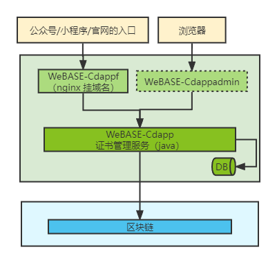

# CDAPP

CDAPP是一套证书模板方案。

## 本方案背景：

很多机构都有发区块链证书的需求，但是有些机构没有开发资源，不能开发自己的区块链证书系统。为了让这部分机构能够使用上区块链证书系统，本方案在为用户提供了安装包，用户安装后便可拥有自己的区块链证书系统。

## 本方案主要目标：

 1、提供安装包，用户只需部署就可使用。

 2、可配置，用户只要配置就可以生成自己个性化的证书和C端页面。

 3、支持生成多种类型证书，用户只要配置就可为自己不同场景生成证书。

 4、代码开源，用户可以二次个性化开发。

## 各模块说明：

### WeBASE-Cdapp：

证书java后台服务

代码路径（dev分支）：[WeBankBlockchain/WeBASE-Cdapp (github.com)](https://github.com/WeBankBlockchain/WeBASE-Cdapp)

接口文档：[WeBASE-Cdapp/interface.md at dev · WeBankBlockchain/WeBASE-Cdapp (github.com)](https://github.com/WeBankBlockchain/WeBASE-Cdapp/blob/dev/interface.md)

### WeBASE-Cdappf：

证书C端H5页面

代码路径（dev分支）：[WeBankBlockchain/WeBASE-Cdappf at dev (github.com)](https://github.com/WeBankBlockchain/WeBASE-Cdappf/tree/dev)

### WeBASE-Cdappadmin：

证书管理台页面

代码路径（dev分支）：[WeBankBlockchain/WeBASE-Cdappadmin at dev (github.com)](https://github.com/WeBankBlockchain/WeBASE-Cdappadmin/tree/dev)

## 安装说明：

[WeBASE-Cdapp/deploy/install.md at dev · WeBankBlockchain/WeBASE-Cdapp (github.com)](https://github.com/WeBankBlockchain/WeBASE-Cdapp/blob/dev/deploy/install.md)

